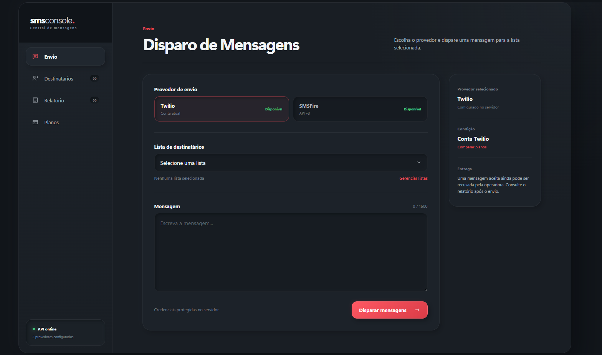
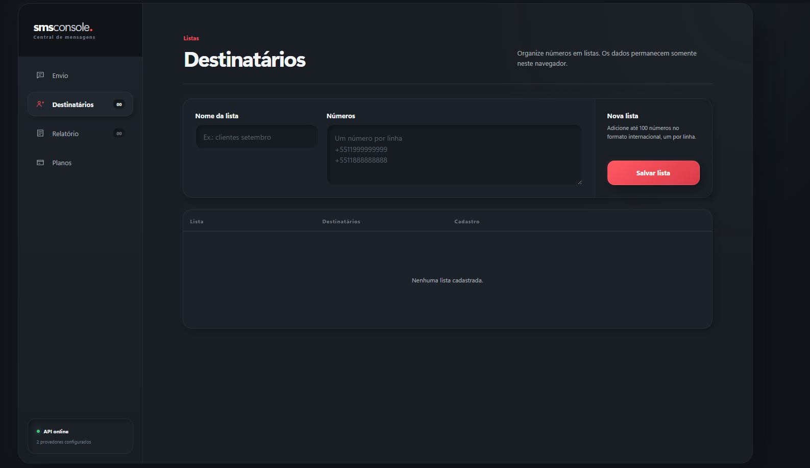
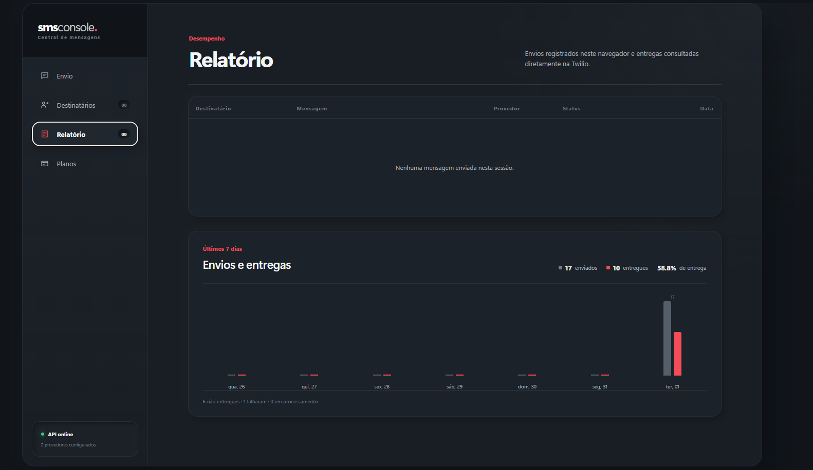
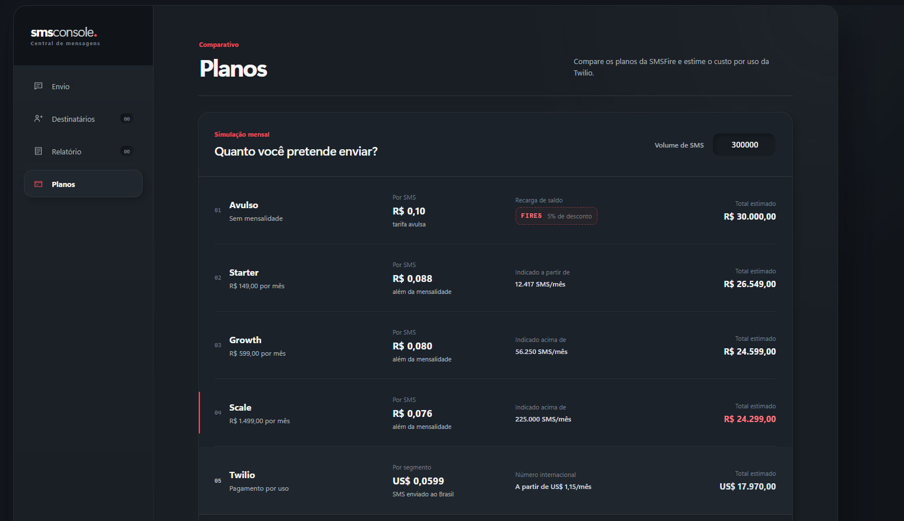

# smsconsole.

[](https://github.com/threej4y-free/sms-console-twilio/actions/workflows/ci.yml)

Painel local para organizar destinatários, escolher o provedor e disparar SMS pela Twilio ou SMSFire.

O projeto combina uma API Node.js/TypeScript com uma interface web responsiva. As credenciais permanecem no servidor, as listas são armazenadas no navegador e o relatório consulta os status reais das mensagens na Twilio. A integração SMSFire utiliza a API v3 e seu endpoint de envio em massa.

## Interface

<p align="center">
  <a href="docs/screenshots/envio.png">
    
  </a>
  <br />
  <sub><strong>Painel principal e envio</strong> — seleção entre Twilio e SMSFire, lista e composição da mensagem.</sub>
</p>

<table>
  <tr>
    <td width="50%" align="center">
      <a href="docs/screenshots/destinatarios.png"></a>
      <br /><sub><strong>Destinatários</strong></sub>
    </td>
    <td width="50%" align="center">
      <a href="docs/screenshots/relatorio.png"></a>
      <br /><sub><strong>Relatório</strong></sub>
    </td>
  </tr>
  <tr>
    <td colspan="2" align="center">
      <a href="docs/screenshots/planos.png"></a>
      <br /><sub><strong>Comparador de preços</strong></sub>
    </td>
  </tr>
</table>

Clique em uma imagem para visualizar em tamanho completo.

## Recursos

- Envio individual pela API autenticada.
- Escolha do provedor antes de cada disparo.
- Disparo da mesma mensagem para listas com até 100 números.
- Envio em lote pela SMSFire v3.
- Cadastro de listas no navegador, sem banco de dados.
- Histórico local dos envios realizados pela interface.
- Relatório dos últimos sete dias com disparos separados por provedor, entregas, falhas e taxa de entrega.
- Comparador de planos SMSFire e estimativa de custo Twilio pelo mesmo volume.
- Callback para atualizações de status da Twilio.
- Validação de números no padrão E.164.
- Rate limiting, headers de segurança e tratamento de erros dos provedores.
- Validação criptográfica dos webhooks recebidos.

## Tecnologias

- Node.js 20+
- TypeScript
- Express
- Twilio Node Helper Library e API REST da SMSFire
- Zod
- Vitest e Supertest
- HTML, CSS e JavaScript sem framework no frontend

## Como funciona

```text
Navegador local
    │
    ├── listas e histórico no localStorage
    │
    └── API local ──┬──► Twilio ──► operadora ──► destinatário
                    │        │
                    │        └── webhook de status ──► API
                    │
                    └──► SMSFire v3 ──► operadora ──► destinatário
```

A interface usa rotas restritas a conexões locais. O endpoint público de envio continua protegido por `API_KEY`.

## Pré-requisitos

- Node.js 20 ou superior.
- Conta Twilio e, para habilitar o segundo provedor, conta SMSFire.
- Para Twilio: número habilitado para SMS.
- Para SMSFire: usuário e token HTTP da API v3.
- Destinos liberados pelas permissões geográficas da conta.

Em contas trial, a Twilio permite o envio somente para destinatários verificados. Essa limitação pertence à conta e não pode ser removida pelo código.

## Instalação

Clone o projeto e instale as dependências:

```powershell
git clone https://github.com/threej4y-free/sms-console-twilio.git
Set-Location sms-console-twilio
npm install
```

Crie o arquivo local de configuração:

```powershell
Copy-Item .env.example .env
```

Preencha o `.env` com os dados da sua conta:

```env
NODE_ENV=development
PORT=3001

TWILIO_ACCOUNT_SID=ACxxxxxxxxxxxxxxxxxxxxxxxxxxxxxxxx
TWILIO_AUTH_TOKEN=seu_auth_token
TWILIO_PHONE_NUMBER=+15005550006

SMSFIRE_USERNAME=seu_usuario
SMSFIRE_API_TOKEN=seu_token_http
SMSFIRE_BASE_URL=https://api-v3.smsfire.com.br
SMSFIRE_TIMEOUT_MS=10000

API_KEY=gere-uma-chave-longa-e-aleatoria
PUBLIC_BASE_URL=
TWILIO_VALIDATE_WEBHOOKS=true
```

Nunca envie o `.env` ao Git. O arquivo já está incluído no `.gitignore` e no `.npmignore`.

## Executar localmente

```powershell
npm run dev
```

Abra o painel:

<http://localhost:3001>

Verifique a API:

```powershell
Invoke-RestMethod http://localhost:3001/health
```

## Usar o painel

### 1. Criar uma lista

Abra **Destinatários**, informe um nome e cole um número por linha:

```text
+5511999999999
+5511888888888
```

Os números devem estar no formato E.164: sinal de `+`, código do país, DDD e telefone, sem zero de operadora.

### 2. Enviar uma mensagem

Abra **Envio**, escolha Twilio ou SMSFire, selecione uma lista, escreva a mensagem e confirme o disparo. O servidor retorna quantos envios foram aceitos ou recusados.

A Twilio processa os destinatários individualmente. A SMSFire envia a lista em uma única chamada ao endpoint de lote da API v3. O limite da interface é de 100 destinatários por disparo em ambos os provedores.

### 3. Consultar o relatório

Abra **Relatório** para visualizar:

- histórico salvo neste navegador;
- mensagens enviadas nos últimos sete dias;
- entregas confirmadas;
- taxa de entrega;
- falhas e mensagens ainda em processamento.

O gráfico consulta a API da Twilio e considera até os 1.000 registros de saída mais recentes.

### 4. Comparar planos

Abra **Planos** e informe o volume mensal previsto. O painel calcula mensalidade mais consumo e destaca a opção de menor custo estimado:

> Preços revisados em 1º de setembro de 2026. Tarifas podem mudar sem aviso; confirme os valores antes de contratar ou disparar grandes volumes.

| Plano | Mensalidade | Valor por SMS | Observação |
|---|---:|---:|---|
| Avulso | R$ 0,00 | R$ 0,10 | O cupom `FIRE5` dá 5% de desconto somente na recarga de saldo |
| Starter | R$ 149,00 | R$ 0,088 | Melhor estimativa a partir de 12.417 SMS/mês |
| Growth | R$ 599,00 | R$ 0,080 | Melhor estimativa acima de 56.250 SMS/mês |
| Scale | R$ 1.499,00 | R$ 0,076 | Melhor estimativa acima de 225.000 SMS/mês |

O cupom não altera o preço unitário da mensagem avulsa, que permanece em R$ 0,10. Esses valores foram informados para o projeto; confirme condições comerciais, impostos e validade do cupom diretamente com a SMSFire.

Na linha imediatamente abaixo do Scale, o painel apresenta a Twilio usando o mesmo volume digitado no simulador. Para SMS enviado ao Brasil por número internacional, a tarifa exibida é de **US$ 0,0599 por segmento**, sem conversão automática para reais. Assim, 200.000 segmentos custam aproximadamente **US$ 11.980,00**, sem incluir aluguel do número, câmbio ou taxas adicionais. O aluguel do número internacional parte de **US$ 1,15 por mês**. Consulte sempre a [tabela oficial da Twilio para o Brasil](https://www.twilio.com/pt-br/sms/pricing/br).

## API

### Autenticação

O endpoint `/v1/messages` aceita a chave em um destes headers:

```http
Authorization: Bearer <API_KEY>
```

```http
X-API-Key: <API_KEY>
```

### Enviar um SMS

```http
POST /v1/messages
Content-Type: application/json
Authorization: Bearer <API_KEY>
```

```json
{
  "to": "+5511999999999",
  "body": "Olá pelo smsconsole",
  "provider": "smsfire"
}
```

O campo `provider` aceita `twilio` ou `smsfire` e usa `twilio` quando omitido.

Resposta:

```json
{
  "provider": "smsfire",
  "message": {
    "sid": "019fb102-d95a-758b-a810-9e75c1875361",
    "to": "+5511999999999",
    "from": null,
    "status": "queued",
    "dateCreated": "2026-09-01T12:00:00.000Z",
    "provider": "smsfire"
  }
}
```

### Rotas disponíveis

| Método | Rota | Finalidade | Proteção |
|---|---|---|---|
| `GET` | `/health` | Verificação de saúde | Pública |
| `POST` | `/v1/messages` | Envio individual | API key |
| `POST` | `/ui/messages` | Envio individual pela interface | Apenas local |
| `POST` | `/ui/broadcasts` | Envio para até 100 destinatários | Apenas local |
| `GET` | `/ui/providers` | Provedores configurados, sem expor credenciais | Apenas local |
| `GET` | `/ui/report` | Relatório dos últimos sete dias | Apenas local |
| `POST` | `/ui/message-statuses` | Consulta status atual na Twilio ou SMSFire | Apenas local |
| `POST` | `/webhooks/twilio/message-status` | Atualização de status | Assinatura Twilio |

Referências da integração: [autenticação da API v3](https://docs.smsfire.com.br/apis-v3/autenticacao) e [envio de mensagens](https://docs.smsfire.com.br/apis-v3/sms/api/enviar-mensagem).

## Webhook de status

Para receber atualizações da Twilio, publique a API em uma URL HTTPS e configure:

```env
PUBLIC_BASE_URL=https://sms.seudominio.com
```

Os envios passarão automaticamente este callback:

```text
https://sms.seudominio.com/webhooks/twilio/message-status
```

O endpoint valida o header `X-Twilio-Signature` com o Auth Token. Mantenha `TWILIO_VALIDATE_WEBHOOKS=true` em produção.

## Segurança

- Credenciais Twilio e SMSFire carregadas exclusivamente por variáveis de ambiente.
- `.env`, artefatos de build e dependências fora do Git.
- API key comparada com `timingSafeEqual`.
- Limite de requisições nos endpoints de envio.
- Payload JSON limitado a 20–30 KB.
- Webhook validado criptograficamente.
- Rotas da interface bloqueadas fora do computador local.
- Rotas locais desativadas automaticamente quando `NODE_ENV=production`.

Para disponibilizar o painel publicamente, implemente autenticação de usuário e autorização antes de habilitar disparos remotos.

As rotas `/ui/*` verificam o endereço da conexão e são adequadas somente para desenvolvimento local. Um proxy executado na mesma máquina, combinado com `NODE_ENV` incorreto, pode fazer uma requisição externa chegar ao Express como local. Não publique a interface confiando apenas nessa verificação: use autenticação, autorização, configuração explícita de proxies confiáveis e mantenha as rotas locais desativadas em produção.

## Uso responsável e prevenção de spam

Este projeto é uma base técnica e não substitui análise jurídica ou as políticas dos provedores. Antes de usar em produção:

- envie mensagens apenas para destinatários com uma base válida de consentimento ou outra autorização aplicável;
- registre a origem e a data do consentimento;
- identifique claramente o remetente e a finalidade da mensagem;
- ofereça uma forma simples de descadastro e processe a solicitação antes de novos disparos;
- mantenha uma lista de supressão independente das listas de campanha;
- não use listas compradas, coletadas sem transparência ou com origem desconhecida;
- limite frequência e horários de envio, monitore reclamações e interrompa campanhas com sinais de abuso;
- minimize dados pessoais e defina prazos de retenção para listas, campanhas e logs;
- revise as regras da Twilio, SMSFire, operadoras e a legislação aplicável ao público de destino.

O descadastro automático e a lista de supressão ainda não estão implementados. Eles são requisitos antes de qualquer uso público ou comercial da interface.

## Scripts

| Comando | Descrição |
|---|---|
| `npm run dev` | Inicia o servidor com recarregamento automático |
| `npm run typecheck` | Verifica os tipos sem gerar arquivos |
| `npm test` | Executa os testes automatizados |
| `npm run build` | Compila o TypeScript em `dist/` |
| `npm start` | Executa a versão compilada |

## Estrutura

```text
public/
  index.html          interface
  styles.css          tema e responsividade
  app.js              listas, envios e relatório
src/
  app.ts              rotas, validações e segurança
  config.ts           leitura das variáveis de ambiente
  server.ts           inicialização e encerramento do servidor
  sms-service.ts      integrações Twilio/SMSFire e relatório da Twilio
tests/
  app.test.ts         testes da API e da interface
```

## Limitações atuais

- Listas e histórico são locais ao navegador e não são sincronizados entre dispositivos.
- O histórico visual atualiza os envios pendentes dos dois provedores; para respeitar o limite da SMSFire, consulta uma mensagem a cada 30 segundos.
- O relatório remoto atual é exclusivo da Twilio; os envios SMSFire aparecem no histórico local.
- A Twilio é processada sequencialmente; a SMSFire usa o endpoint em massa. Ambos aceitam até 100 destinatários por solicitação nesta interface.
- A SMSFire aceita até 765 caracteres por mensagem na API v3; a Twilio aceita até 1.600 nesta aplicação.
- Contas trial continuam sujeitas às restrições de destinatários e conteúdo da Twilio.

## Próximos passos

- Persistir campanhas, destinatários, eventos de entrega e histórico em banco de dados.
- Adicionar autenticação de usuário e controle de acesso por função.
- Implementar lista de supressão e fluxo de descadastro.
- Consultar e armazenar status de entrega da SMSFire.
- Criar uma página inicial de indicadores quando houver persistência suficiente para métricas consolidadas.
